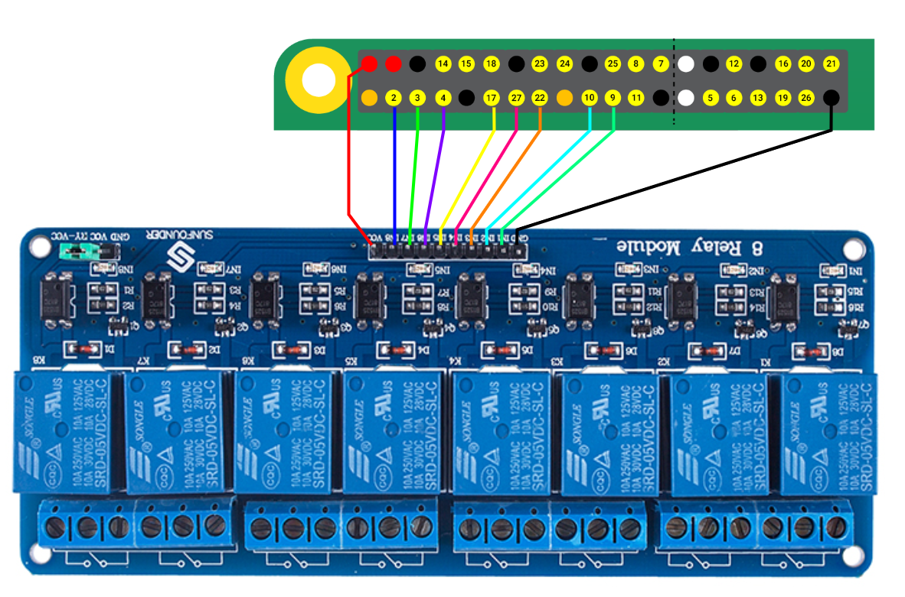

# rpi-switch

_rpi-switch_ is a simple software that lets you control relays connected to a Raspberry Pi's GPIO ports using REST API calls.

## Configuration

_rpi-switch_ can be configured using a single YAML file.

```yaml
ListenAddress: 0.0.0.0 # IP address to listen on
ListenPort: 8080 # TCP port to listen on
PinAssignment: # definition of your relays as key-value pairs
  toaster: 2 # key is an arbitrary name for your relay; value is the GPIO port used to control the corresponding relay
```

## Execution

Build the _rpi-switch_ binary using the `make build` command.

Usage:

```
$ ./rpi-switch -help
Usage of ./rpi-switch:
  -config string
    	Path for the YAML configuration file. (default "config.yaml")
```

Once you have the binary and your config file, you can start _rpi-switch_ like:

```
$ ./rpi-switch -config config.yaml
```

## Installation

You can install _rpi-switch_ with the `make install` command.

This will create the `/opt/rpi-switch` directory, copy the necessary files under the directory, then add the [_rpi-switch_ systemd service](misc/rpi-switch.service).

This will help you easily stop (`systemctl stop rpi-switch`), start (`systemctl start rpi-switch`) the software and will make sure to automatically start it for you on startup.

## REST API

The HTTP endpoint base is `/relay`. All the configured relays are available under the endpoint base: `/relay/{name}` (for example `/relay/toaster`).

### API model

The API accepts and returns JSON messages in the following format:

```json
{"state": 0}
```

`0` represents the "off" state, `1` represents the "on" state.

### Verbs

Use `POST` to set the state, and `GET` to retrieve the state of your relays.

## Example



Assuming you have an 8-channel relay module connected to the `2`, `3`, `4`, `17`, `27`, `22`, `10`, and `9` GPIO ports (similarly to the diagram above), your configuration file should look like this:

```yaml
ListenAddress: 0.0.0.0
ListenPort: 8080
PinAssignment:
  relay1: 9
  relay2: 10
  relay3: 22
  relay4: 27
  relay5: 17
  relay6: 4
  relay7: 3
  relay8: 2
```

### Changing relay states

To turn on `relay6`, you can use the following API request:

```
$ curl -X POST -d '{"state": 1}' 127.0.0.1:8080/relay/relay6
{"state":1}
```

### Getting relay states

To see whether `relay2` is on or not, you can use the following API request:

```
$ curl -X GET 127.0.0.1:8080/relay/relay2
{"state":1}
```

## Using with Home Assistant

[RESTful switch](https://www.home-assistant.io/integrations/switch.rest/):

>The `rest` switch platform allows you to control a given endpoint that supports a [RESTful API](https://en.wikipedia.org/wiki/Representational_state_transfer). The switch can get the state via GET and set the state via POST on a given REST resource.

### Example configuration

Add a similar snippet to your `configuration.yaml`:

```yaml
switch:
  - platform: rest
    resource: http://<rpi-ip-address>:8080/relay/toaster
    name: Toaster
    timeout: 3
    body_on: "{\"state\":1}"
    body_off: "{\"state\":0}"
```
